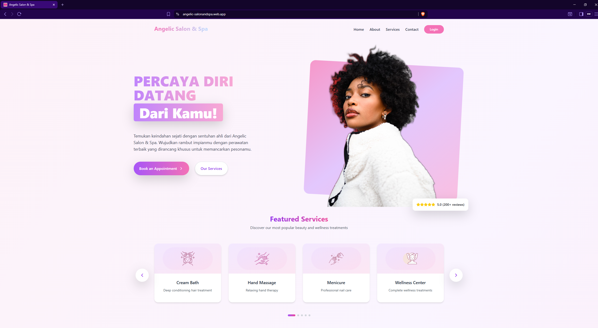

# 💇‍♀️ Angelic Salon & Spa

A web-based **salon & spa booking system** designed with a clean, modern **white–pink theme**.  
The project is built using **React + Vite** and styled with **Tailwind CSS**.

👉 Check the **Website** here: [angelic-salonandspa.web.app](https://angelic-salonandspa.web.app/)  
📚 For full documentation including images and videos, you can visit my portfolio: [Click Me!](https://portfolio-adnanalvito.vercel.app/projects/3)

---

## ✨ Description

This website is designed to help customers easily book various salon and spa services such as:
- Haircuts  
- Spa treatments  
- Facial care  
- And other beauty services  

The application was developed as a **real collaboration project** with **Angelic Salon & Spa**, a beauty salon located in **Prabumulih, South Sumatra, Indonesia**.  
It was created as part of a **university course project**, where I was required to partner with a real business.  

Through this collaboration, the website aims to help the salon **digitize its booking process, service scheduling, and daily operations**.  
Previously, most activities such as booking records, customer lists, and financial reports were **manually written in a physical logbook**.  
Now, this website allows the salon to:
- Record and manage bookings digitally  
- Track monthly customer statistics  
- Manage financial transactions and revenue summaries  
- Simplify administrative tasks through a web-based dashboard  

The app also includes a **Firebase-based login system** and an **admin dashboard** for managing hairstylists, schedules, and service listings.

---

## 💡 Key Features

- 🧾 Online salon service booking system  
- 👩‍🎨 Hairstylist selection with availability indicators  
- ⏰ Automated scheduling and booking status updates  
- 💰 Basic financial tracking and monthly customer statistics  
- 🔐 Login and account management with Firebase  
- 🖼️ Clean and elegant white–pink user interface  
- 📱 Fully responsive design for all screen sizes  

---

## 🧰 Tech Stack

---
